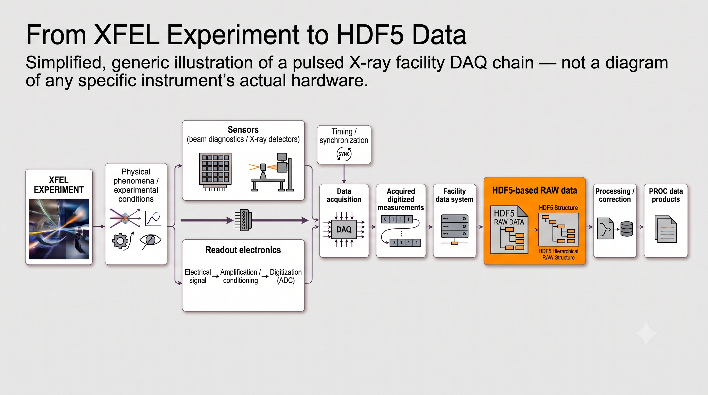

# Case Study: From XFEL Experiment to HDF5 Data

## Idea

This case study was intended to get an understanding of how an XFEL experiment generates HDF5 data. It starts by looking at how the experiment is set up, the different systems involved, and what they do.

It then follows how the measurements produced by these systems are collected, processed, and organized until they become HDF5 data that can be used for further analysis.

## The XFEL Experiment

The image below shows a conceptual view of how an XFEL experiment works and how the measurements reach HDF5 data. The experiment uses X-ray detectors and beam diagnostic systems to record different measurements. The signals from these systems are handled by readout electronics and collected by the data acquisition system. The facility data system then organizes the acquired data as HDF5 data. The data can also be processed to produce PROC data products.

<p align="center">
  
</p>

### 1. XFEL Experiment

An XFEL experiment uses X-ray pulses to investigate a physical process. The experiment is set up with the equipment, detectors and diagnostic systems needed for the measurement.

- The X-ray beam is directed towards the experimental setup.
- The X-rays interact with the sample or experimental system.
- The interaction produces information that needs to be measured.
- Detectors and diagnostic systems are used to record this information.

### 2. Sensors

X-ray detectors and beam diagnostic systems are used to make the measurements.

- X-ray detectors measure information from the X-ray interaction.
- Beam diagnostics measure properties of the X-ray beam.
- The sensors produce electrical signals from these measurements.

### 3. Readout Electronics

The readout electronics handle the signals produced by the sensors.

- The signals are amplified or conditioned.
- An ADC converts the signals into digital values.
- The digital measurements are passed to the data acquisition system.

### 4. Data Acquisition

The data acquisition system collects the digital measurements from the different systems.

- The measurements are collected during the experiment.
- Timing and synchronization associate measurements with the same acquisition.
- The acquired data is passed to the facility data system.

### 5. Facility Data System

The facility data system organizes the data collected during the experiment.

- Measurements from different sources are stored together.
- The data is associated with the experiment, proposal and run.
- The data is stored as HDF5 data.

### 6. HDF5 Data

HDF5 provides the structure used to store the experimental data.

- A run contains different sources.
- A source contains different measurements.
- The measurements can be accessed by analysis software.

### 7. Processing and PROC Data

The recorded data can also be processed to produce PROC data.

- RAW data contains the recorded experimental data.
- Processing applies corrections or other transformations.
- PROC data contains the processed measurements.

The HDF5 data now contains the experimental measurements in a form that can be accessed by analysis software.


## The Experimental Data

### Data Source

The data used for the examples in this case study comes from the European XFEL example datasets. European XFEL provides these datasets so that users can work with example experimental data before their own experiment.

The example data is provided under the `XMPL` example instrument and follows the same data structure used for experiment data at the facility. The example proposal is `p700000` under cycle `201750`. The datasets contain RAW and processed data from different experiments and detectors.

The data can be accessed using the European XFEL data analysis tools. The examples below use the HDF5 source and measurement structure encountered in the example data.

## HDF5 Data Structure

HDF5 provides a structured way of storing the measurements produced during an experiment. The structure contains different sources, and each source can contain different measurements. The exact sources and measurements depend on the systems used in the experiment.

The following examples show the structure of the beam and detector data.

### Beam Measurements

The RAW data contains several beam diagnostic sources. The following is an example of the measurements available in the dataset.

#### Example 1 — RAW Beam Data

```text
RAW
│
├── SPB_XTD9_XGM/DOOCS/MAIN:output
│   ├── data.intensityTD
│   ├── data.intensitySigmaTD
│   ├── data.xTD
│   ├── data.xSigmaTD
│   ├── data.yTD
│   └── data.ySigmaTD
│
├── SA1_XTD9_HIREX/CAL/MASTER:daqOutput
│   └── data.image.pixels
│
├── SA1_XTD9_HIREX/CAL/SLAVE:daqOutput
│   └── data.image.pixels
│
├── SA1_XTD9_HIREX/DAQ/GOTTHARD_MASTER:daqOutput
│   ├── data.adc
│   ├── data.frameNumber
│   ├── data.gain
│   ├── data.memoryCell
│   ├── data.timestamp
│   └── data.trainId
│
└── SA1_XTD9_HIREX/DAQ/GOTTHARD_SLAVE:daqOutput
    ├── data.adc
    ├── data.frameNumber
    ├── data.gain
    ├── data.memoryCell
    ├── data.timestamp
    └── data.trainId
```
#### XGM

The XGM source provides beam intensity and position measurements.

- `data.intensityTD` contains the beam intensity.
- `data.intensitySigmaTD` contains the uncertainty of the intensity measurement.
- `data.xTD` contains the X position.
- `data.xSigmaTD` contains the uncertainty of the X position.
- `data.yTD` contains the Y position.
- `data.ySigmaTD` contains the uncertainty of the Y position.

#### HIREX

The HIREX sources provide diagnostic image measurements.

- `data.image.pixels` contains the image data from the MASTER source.
- `data.image.pixels` contains the image data from the SLAVE source.

#### Gotthard

The Gotthard sources provide ADC measurements and information about the acquired data.

- `data.adc` contains the ADC measurement.
- `data.frameNumber` identifies the frame.
- `data.gain` contains the gain information.
- `data.memoryCell` identifies the memory cell.
- `data.timestamp` contains the timestamp.
- `data.trainId` identifies the train.

The same measurements are available for both the MASTER and SLAVE Gotthard sources.


### Detector Measurements

The detector measurements are available in the PROC data.

#### Example 2 — PROC Detector Data

```text
PROC
│
├── FXE_DET_LPD1M-1/DET/0CH0:xtdf
│   ├── image.data
│   ├── image.gain
│   ├── image.mask
│   ├── image.cellId
│   └── image.pulseId
│
├── FXE_DET_LPD1M-1/DET/1CH0:xtdf
│   ├── image.data
│   ├── image.gain
│   ├── image.mask
│   ├── image.cellId
│   └── image.pulseId
│
├── FXE_DET_LPD1M-1/DET/2CH0:xtdf
│   ├── image.data
│   ├── image.gain
│   ├── image.mask
│   ├── image.cellId
│   └── image.pulseId
│
├── ...
│
└── FXE_DET_LPD1M-1/DET/15CH0:xtdf
    ├── image.data
    ├── image.gain
    ├── image.mask
    ├── image.cellId
    └── image.pulseId
```

#### PROC Detector Measurements

The detector source contains the image data together with measurements that describe the detector data.

- `image.data` contains the detector image data.
- `image.gain` contains the gain information.
- `image.mask` contains the detector mask.
- `image.cellId` identifies the memory cell.
- `image.pulseId` identifies the pulse.

The beam and detector examples show two different parts of the experimental data. The RAW example contains beam diagnostic measurements from XGM, HIREX and Gotthard. The PROC example contains the LPD detector modules.

The source identifies where the data comes from. The measurement identifies what data is provided by that source.

The exact sources and measurements depend on the experiment and the systems used during the acquisition.

